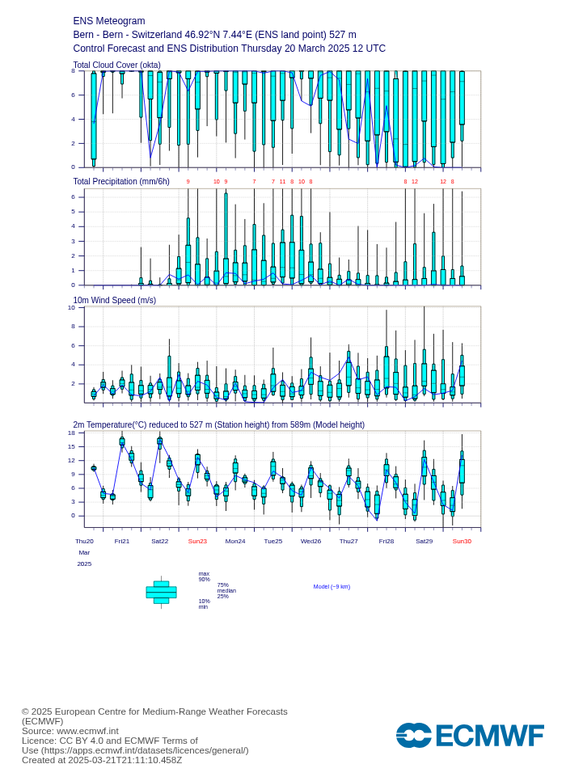
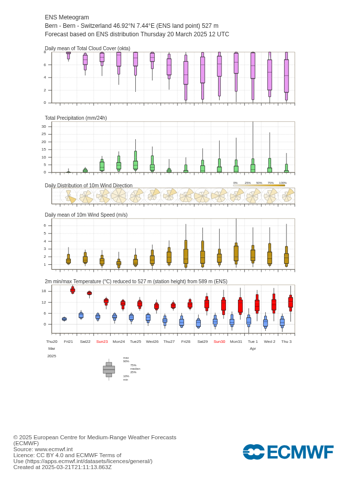
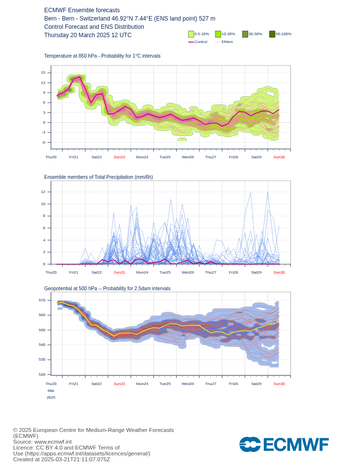
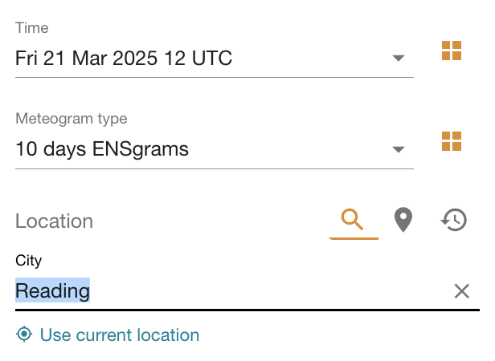
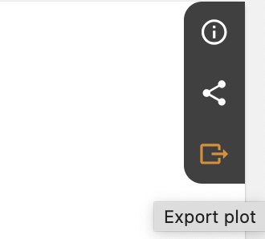
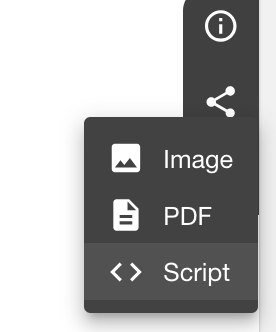
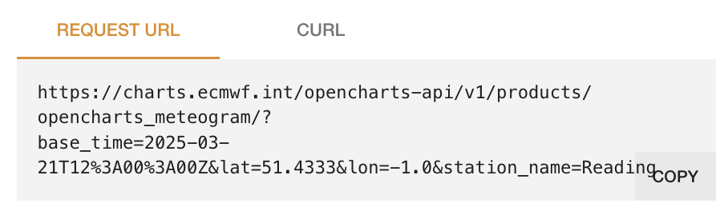

# EnsPlotBot

[EnsPlotBot](https://t.me/EnsPlotBot) is a Telegram bot that provides ECMWF meteograms for various locations in Switzerland. The bot allows users to subscribe to daily forecasts or request one-time forecasts for specific locations.

   

## Features

- Subscribe to daily ECMWF meteograms for specific locations.
- Request one-time ECMWF meteograms for specific locations.
- View available locations
- Unsubscribe from daily forecasts

## Adding a new location

To add a new location to the bot, follow these steps:

1. Open the [stations.yaml](stations.yaml) file in the repository.
2. Add a new entry for the station with the following format, e.g. for Geneva:
    ```yaml
    - name: Geneva
      api_name: Gen%C3%A8ve # needed for names with special character like é or è
      region: Romandie
      lat: 46.2022
      lon: 6.14569
    ```
3. Obtain the `api_name`, `lat`, and `lon` values from the [Opencharts website](https://charts.ecmwf.int/products/opencharts_meteogram?base_time=202503211200&epsgram=classical_10d&lat=51.4333&lon=-1.0&station_name=Reading):
    - Find your location on the map.

       
    - Click on "Export plot" on the right side.

      
    - Choose `< > script`

      
    - This will generate a link where the correct coordinates (`lat`, `lon`) and the `api_name` are visible.
    
      
    - Copy these three values and add them to the `stations.yaml` file.

## Contributing

Contributions are welcome! Please open an issue or submit a pull request on GitHub.
